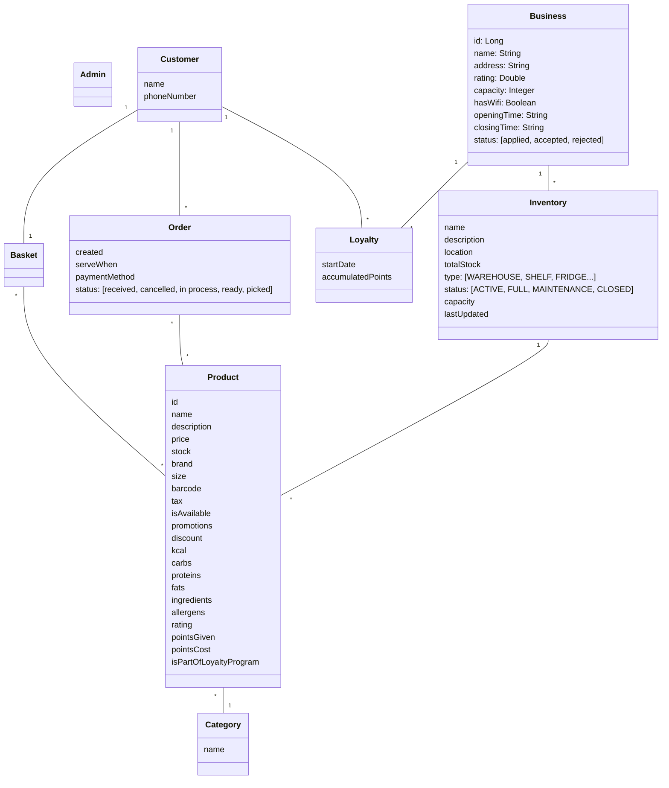

# MyCoffee API

Template for a Spring Boot project including Spring REST, HATEOAS, JPA, etc. Additional details: [HELP.md](HELP.md)

## Vision

**For** ... **who** want to ...
**the project** ... **is an** ...
**that** allows ...
**Unlike** other ...

## Features per Stakeholder

| Customer                                 | Business              | Admin              |
|------------------------------------------|-----------------------|--------------------|
| Register                                 | Apply                 | Accept Application |
| Login                                    | Login                 | Reject Application |
| Logout                                   | Logout                |                    |
| List Businesses                          | Add Product           |                    |
| List Business Inventory                  | Upload Inventory      |                    |
| Select product                           | Download Inventory    |                    |
| Deselect product                         | Manage Stock          |                    |
| Checkout   (when and payment method) | List Orders (by when) |                    |
| List orders                              | Cancel                |                    |
|                                          | Process               |                    |
|                                          | Ready/Message         |                    |
|                                          | Picked/Paid           |                    |
|                                          | Set Loyalty Card      |                    |
|                                          | Cancel Loyalty Card   |                    |

## Entities Model

